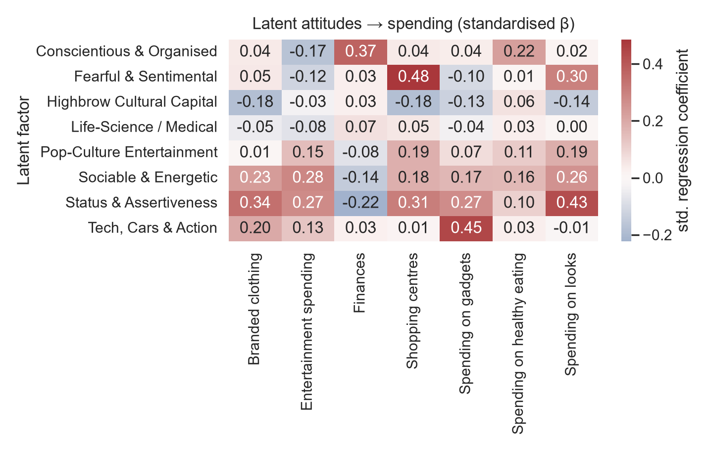

# Latent Consumer Insights: The Hidden Attitudes Behind Young Consumers' Spending

Turning a raw self-report survey into **latent consumer needs** — the motives people can't state on a questionnaire — and then into actionable **personas**, using exploratory factor analysis + segmentation on the *Young People Survey* (1,010 respondents aged 15–30).

> **Motivation.** Modern marketing research aims to extract *"latent needs that even consumers themselves are not aware of yet."* That is a latent-variable problem — so this project solves it with the classical latent-variable tool: factor analysis. The battery of things people *report* is treated as the surface; the factor model recovers the hidden attitudes that generate it.

📄 **[Full research write-up → REPORT.md](REPORT.md)**



## TL;DR finding

A latent **Status & Assertiveness** motive — one that *no single survey question names* — is the single strongest cross-category driver of visible, premium spending: appearance (**β = +0.43**), branded clothing (+0.34), shopping malls (+0.31), gadgets (+0.27) — and the strongest **anti-saving** force (−0.22). A separate, emotionally-driven "retail-therapy" motive best explains mall enjoyment (+0.48), while cultural sophistication *suppresses* conspicuous spending. Consumers never state these motives; the covariance structure reveals them.

## What's inside

| Stage | Method | Result |
|---|---|---|
| Factorability | KMO + Bartlett's test | KMO = **0.81** (meritorious), Bartlett *p* < .001 — battery is strongly factorable |
| Latent needs | Varimax exploratory factor analysis (128 items → 8 factors) | 8 interpretable dimensions incl. emergent **Status & Assertiveness** and **Fearful & Sentimental** |
| Personas | K-means on factor scores (k = 5) | 5 balanced archetypes, from *Trend & Retail-Therapy Shoppers* to *Cultured Minimalists* |
| Spending drivers | OLS: 7 spend outcomes ~ 8 latent factors | Looks **R² = .29**, malls .26, gadgets .21; status motive dominates |

## The five personas

| Persona | Share | Signature |
|---|---:|---|
| Trend & Retail-Therapy Shoppers | 24% | Highest mall & looks spend, lowest saver |
| Gadget-Led Individualists | 21% | Highest gadget & branded-clothing spend |
| Cultured Minimalists | 19% | Lowest spender in nearly every category |
| Well-Rounded Achievers | 18% | Highest healthy-eating spend, broadly engaged |
| Caring Science Students | 17% | Health-tilted, otherwise modest |

## Repository structure

```
analysis.py            # full pipeline: clean → EFA → personas → driver models
data/
  responses.csv        # Young People Survey, 1010 × 150
  columns.csv          # short-name ↔ original-question dictionary
figures/               # 8 generated figures (spending, scree, loadings, personas, drivers)
results/               # generated tables (factor loadings, variance, personas, drivers)
REPORT.md              # research-paper-style write-up
requirements.txt
```

## Reproduce

```bash
pip install -r requirements.txt
python analysis.py
```

Deterministic (`RNG = 42`). Regenerates every figure and table in ~30 s.

## Data

Sabo, M. (2013). *Young People Survey* — collected by a Statistics class at FSEV, Comenius University Bratislava; released on Kaggle. Slovak respondents aged 15–30. Used here for unsupervised insight extraction (most public analyses use it for supervised prediction).

## Note on scope

The dataset is a 2013 Slovak student sample, so results are a **methodological demonstration** of the "raw survey → latent needs → personas" pipeline, not a live market forecast. 
